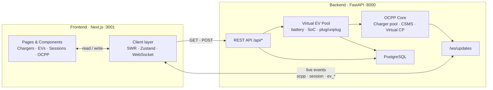
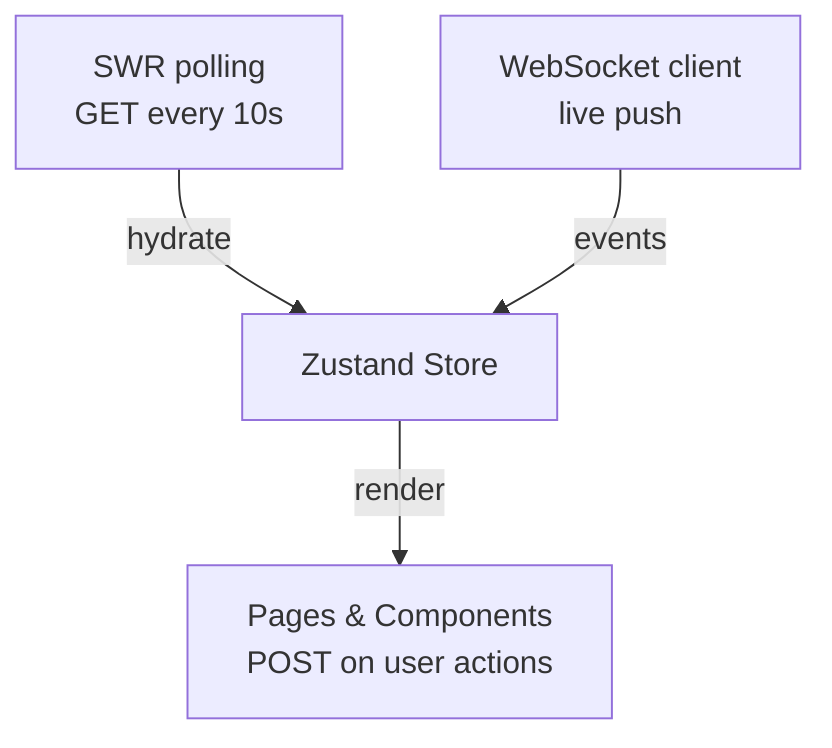
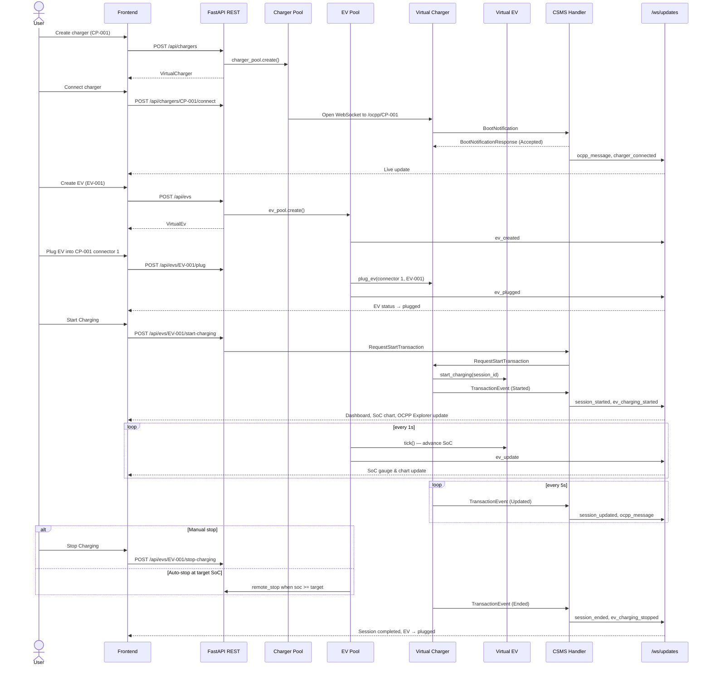

# EV-SIM Frontend

Next.js dashboard for **EV-SIM** — an interactive platform that simulates **virtual electric vehicles (EVs)** and **virtual chargers** connected to a CitrineOS-inspired CSMS over **OCPP 2.0.1**. The frontend provides EV fleet management (create, plug, charge, monitor SoC), live charger monitoring, session tracking, OCPP message inspection, and educational content.

**Backend repo:** [EV-SIM backend](https://github.com/Shriyansh2004/EV-SIM-backend) (or run from `../backend` in a local checkout)

---

## Tech Stack

| Layer | Technology | Version |
|-------|------------|---------|
| Framework | [Next.js](https://nextjs.org/) (App Router) | `14.2.35` |
| Language | TypeScript | `^5` |
| UI | React | `^18.3.1` |
| Styling | Tailwind CSS | `^3.4.1` |
| State | Zustand | `^5.0.3` |
| Data fetching | SWR | `^2.3.0` |
| Charts | Recharts | `^2.15.0` |
| Icons | Lucide React | `^0.469.0` |
| Utilities | clsx | `^2.1.1` |
| Linting | ESLint + eslint-config-next | `^8` / `14.2.35` |

### Backend (paired service)

| Layer | Technology | Version |
|-------|------------|---------|
| Runtime | Python | 3.10+ |
| API | FastAPI | `>=0.115.0` |
| Server | Uvicorn | `>=0.32.0` |
| OCPP | mobilityhouse/ocpp | `>=2.0.0` |
| WebSockets | websockets | `>=13.0` |
| Validation | Pydantic | `>=2.0.0` |
| Database | PostgreSQL + SQLAlchemy | 16 / `>=2.0.0` |

---

## Quick Start

### Prerequisites

- Node.js 18+
- EV-SIM backend running on port **8000**
- PostgreSQL running (via `docker compose up -d` in `../backend`)

### Install & run

```bash
npm install
npm run dev
```

Open [http://localhost:3001](http://localhost:3001)

### Scripts

| Command | Description |
|---------|-------------|
| `npm run dev` | Dev server on port 3001 |
| `npm run build` | Production build |
| `npm run start` | Serve production build on port 3001 |
| `npm run lint` | Run ESLint |

### Environment variables

Create `.env.local` (optional — defaults work for local dev):

```env
NEXT_PUBLIC_API_URL=http://localhost:8000
NEXT_PUBLIC_WS_URL=ws://localhost:8000/ws/updates
```

---

## Full-Stack Architecture

### System overview



| Arrow | From | To | What flows |
|-------|------|----|------------|
| → | Pages | Client layer | User actions, rendered state |
| → | Client layer | REST API | `GET` polls + `POST` commands |
| ↔ | Client layer | `/ws/updates` | Real-time OCPP, charger, session, and EV events |
| → | REST API | OCPP Core + EV Pool | Create/connect/control chargers and EVs |
| → | EV Pool | OCPP Core | Plugged EV drives charge power and meter values |
| → | OCPP Core | `/ws/updates` | Broadcast session, charger, and message updates |

### Frontend client layer (detail)



Four nodes in a straight top-to-bottom flow — no crossing arrows.

### Data flow

1. **Initial load** — `useInitialData` polls REST endpoints every 5–15s (EVs polled every 5s) and hydrates the Zustand store.
2. **Live updates** — `useOcppWebSocket` connects to `/ws/updates` and applies real-time events (`ocpp_message`, `charger_update`, `session_started`, `ev_update`, etc.).
3. **User actions** — Pages call `apiPost` / `apiDelete` to trigger backend commands (create charger/EV, plug, start/stop charging, fault injection).
4. **EV simulation** — Backend simulator ticks EV batteries every 1s; charge power follows a realistic taper curve; OCPP meter values reflect EV telemetry.
5. **OCPP layer** — Virtual chargers speak OCPP 2.0.1 to the CSMS handler; every message is logged and broadcast to the frontend.

### End-to-end charging workflow

The recommended flow is **EV-centric**: create a charger, connect it, create an EV, plug the EV, then start charging.



---

## Folder Structure

```
frontend/
├── app/                        # Next.js App Router pages
│   ├── layout.tsx              # Root layout (metadata, global CSS)
│   ├── client-layout.tsx       # Sidebar nav, WebSocket + data hooks
│   ├── globals.css             # Tailwind base styles & theme tokens
│   ├── page.tsx                # Dashboard (/)
│   ├── chargers/
│   │   ├── page.tsx            # Charger list & create form
│   │   └── [id]/page.tsx       # Single charger detail view
│   ├── evs/
│   │   ├── page.tsx            # EV fleet list & create form
│   │   └── [id]/page.tsx       # EV detail: SoC chart, plug, charge controls
│   ├── sessions/page.tsx       # Session history & energy charts
│   ├── ocpp-explorer/page.tsx  # OCPP message log & inspector
│   └── learn/page.tsx          # OCPP education & interactive wizard
│
├── components/
│   ├── chargers/               # Charger-specific UI
│   ├── evs/                    # EV-specific UI (cards, SoC chart, plug panel)
│   ├── charts/                 # Recharts visualizations
│   ├── ocpp/                   # OCPP protocol UI
│   ├── sessions/               # Session tables & modals
│   └── ui/                     # Shared primitives (badges, cards)
│
├── lib/
│   └── evPresets.ts            # Client-side EV preset fallback (mirrors backend)
│
├── hooks/
│   ├── useInitialData.ts       # SWR polling + REST helpers
│   └── useOcppWebSocket.ts     # WebSocket connection & reconnect
│
├── store/
│   └── index.ts                # Zustand global state
│
├── types/
│   └── index.ts                # TypeScript types & API mappers
│
├── next.config.js              # Next.js configuration
├── tailwind.config.ts          # Design tokens & Tailwind theme
├── tsconfig.json               # TypeScript paths (@/* alias)
├── postcss.config.js           # PostCSS (Tailwind + Autoprefixer)
├── package.json
└── .gitignore
```

---

## File Reference

### App (`app/`)

| File | Purpose |
|------|---------|
| `layout.tsx` | Server root layout. Sets page metadata (title, OG tags) and wraps all pages in `ClientLayout`. |
| `client-layout.tsx` | Client shell with sidebar navigation, live WebSocket indicator, and global hooks (`useOcppWebSocket`, `useInitialData`). |
| `globals.css` | Global styles, CSS variables, and Tailwind `@layer` directives for the dark theme. |
| `page.tsx` | **Dashboard** — summary metrics (chargers, EVs, sessions, energy), charger grid, recent OCPP log, power chart. |
| `chargers/page.tsx` | **Charger Management** — create/delete chargers, connect/disconnect to CSMS via REST. |
| `chargers/[id]/page.tsx` | **Charger Detail** — live metrics, connector panel (plugged EVs), state machine, remote controls, per-charger OCPP log. |
| `evs/page.tsx` | **EV Fleet** — fleet summary (total/plugged/charging), create EV from preset or custom, delete idle EVs. |
| `evs/[id]/page.tsx` | **EV Detail** — live SoC chart, battery panel, plug/unplug panel, start/stop charging controls. |
| `sessions/page.tsx` | **Session Monitor** — energy bar chart, sortable session table (with linked EV), detail modal with meter values. |
| `ocpp-explorer/page.tsx` | **OCPP Explorer** — filterable message log, JSON payload inspector, reference sequence diagram. |
| `learn/page.tsx` | **Education** — OCPP concepts, charging sequence diagram, interactive BootNotification wizard. |

### Components (`components/`)

#### Chargers

| File | Purpose |
|------|---------|
| `ChargerCard.tsx` | Compact card showing charger ID, status badge, power, and connection state. |
| `ChargerGrid.tsx` | Responsive grid layout of `ChargerCard` components. |
| `ChargerStateDisplay.tsx` | Visual state machine highlighting the charger's current OCPP status. |
| `ChargerControls.tsx` | Action buttons: Remote Start/Stop, Reset, Set Unavailable, Unlock, Inject Fault. |
| `ConnectorPanel.tsx` | Per-connector view showing plugged EV, status, and occupancy. |

#### EVs

| File | Purpose |
|------|---------|
| `EvCard.tsx` | Compact card showing EV ID, status badge, SoC, vendor/model, and plugged charger. |
| `EvCreateForm.tsx` | Create EV form with preset picker (Tesla, BMW, etc.) or custom battery parameters. |
| `EvStatusBadge.tsx` | Color-coded badge for EV states (`idle`, `plugged`, `charging`, `full`). |
| `EvBatteryPanel.tsx` | Detailed battery stats: capacity, target SoC, power, voltage, current, energy delivered. |
| `EvBatteryMonitor.tsx` | Compact battery monitor widget for dashboard embedding. |
| `EvSocChart.tsx` | Live line chart of SoC over time (updates via `ev_update` WebSocket events). |
| `EvPlugPanel.tsx` | Select charger + connector, plug/unplug EV. Shows occupied connectors. |
| `EvChargeControls.tsx` | Start/Stop charging buttons (`POST /api/evs/{id}/start-charging`, `/stop-charging`). |

#### Charts

| File | Purpose |
|------|---------|
| `PowerChart.tsx` | Live line chart of charging power (kW) across active chargers. |
| `SocGauge.tsx` | Circular gauge for State of Charge percentage. |
| `EnergyBarChart.tsx` | Bar chart comparing energy delivered (kWh) per session. |

#### OCPP

| File | Purpose |
|------|---------|
| `OcppMessageCard.tsx` | Single OCPP message row with direction, action, and timestamp. |
| `OcppMessageLog.tsx` | Scrollable list of OCPP messages, optionally filtered by charger. |
| `OcppMessageInspector.tsx` | Detailed JSON payload viewer with field descriptions from `OCPP_FIELD_DESCRIPTIONS`. |
| `SequenceDiagram.tsx` | Static reference diagram of the OCPP 2.0.1 charging handshake flow. |

#### Sessions

| File | Purpose |
|------|---------|
| `SessionTable.tsx` | Table of all sessions with status, energy, and duration. |
| `SessionDetailModal.tsx` | Modal with full session details and meter value history chart. |
| `MeterValueChart.tsx` | Time-series chart of power/energy/SoC from meter values. |

#### UI

| File | Purpose |
|------|---------|
| `StatusBadge.tsx` | Color-coded badge for OCPP connector statuses (Available, Charging, Faulted, etc.). |
| `MetricCard.tsx` | Dashboard stat card with icon, label, and value. |
| `LiveIndicator.tsx` | Sidebar indicator showing WebSocket connection health. |

### Hooks (`hooks/`)

| File | Purpose |
|------|---------|
| `useInitialData.ts` | Polls `/api/chargers`, `/api/evs` (5s), `/api/sessions`, and `/api/ocpp/messages` via SWR and syncs into Zustand. Exports `apiPost` and `apiDelete` helpers used by pages. |
| `useOcppWebSocket.ts` | Maintains a persistent WebSocket to `/ws/updates` with auto-reconnect (3s). Dispatches events to `handleWsEvent` in the store. |
| `useEvPresets()` | Fetches `/api/evs/presets` with client-side fallback from `lib/evPresets.ts`. |

### Store (`store/`)

| File | Purpose |
|------|---------|
| `index.ts` | Zustand store holding `chargers`, `evs`, `sessions`, `ocppMessages`, and `wsConnected`. `handleWsEvent` routes WebSocket event types (including `ev_*`) to the correct state updaters. |

### Types (`types/`)

| File | Purpose |
|------|---------|
| `index.ts` | TypeScript interfaces (`VirtualCharger`, `VirtualEv`, `EvPreset`, `Session`, `OcppMessage`, `MeterValue`). Snake_case → camelCase mappers for API responses. `API_BASE` and `WS_URL` constants. OCPP action descriptions for the inspector. |

### Config

| File | Purpose |
|------|---------|
| `next.config.js` | Enables React Strict Mode. |
| `tailwind.config.ts` | Dark theme color palette (`background`, `accent`, `charging`, etc.) and font families. |
| `tsconfig.json` | TypeScript config with `@/*` path alias to project root. |
| `postcss.config.js` | PostCSS pipeline for Tailwind and Autoprefixer. |
| `next-env.d.ts` | Auto-generated Next.js type references (do not edit). |

---

## Backend API Integration

The frontend talks to the FastAPI backend on port **8000**.

### REST endpoints used

| Method | Path | Used by | Description |
|--------|------|---------|-------------|
| `GET` | `/api/chargers` | `useInitialData` | List all virtual chargers |
| `POST` | `/api/chargers` | Chargers page, Learn wizard | Create a new charger |
| `DELETE` | `/api/chargers/{id}` | Chargers page | Remove a charger |
| `POST` | `/api/chargers/{id}/connect` | Chargers page, Learn wizard | Connect charger to CSMS (triggers BootNotification) |
| `POST` | `/api/chargers/{id}/disconnect` | Chargers page | Disconnect from CSMS |
| `POST` | `/api/chargers/{id}/fault` | ChargerControls | Inject a simulated fault |
| `GET` | `/api/evs` | `useInitialData` | List all virtual EVs |
| `GET` | `/api/evs/presets` | `useEvPresets`, EvCreateForm | Built-in vehicle presets |
| `POST` | `/api/evs` | Evs page, EvCreateForm | Create a new EV |
| `DELETE` | `/api/evs/{id}` | Evs page | Remove an EV |
| `POST` | `/api/evs/{id}/plug` | EvPlugPanel | Plug EV into charger connector |
| `POST` | `/api/evs/{id}/unplug` | EvPlugPanel | Unplug EV from charger |
| `POST` | `/api/evs/{id}/start-charging` | EvChargeControls | Start OCPP session (EV must be plugged) |
| `POST` | `/api/evs/{id}/stop-charging` | EvChargeControls | Stop active charging session |
| `GET` | `/api/sessions` | `useInitialData` | List all charging sessions |
| `POST` | `/api/sessions/start` | ChargerControls | Remote start (RequestStartTransaction) |
| `POST` | `/api/sessions/stop` | ChargerControls | Remote stop (RequestStopTransaction) |
| `POST` | `/api/commands/reset` | ChargerControls | Send Reset command |
| `POST` | `/api/commands/availability` | ChargerControls | ChangeAvailability command |
| `POST` | `/api/commands/unlock` | ChargerControls | UnlockConnector command |
| `GET` | `/api/ocpp/messages` | `useInitialData` | Fetch OCPP message history |

### WebSocket events (`/ws/updates`)

| Event type | Payload | Store action |
|------------|---------|--------------|
| `ocpp_message` | Full OCPP log entry | `addOcppMessage` |
| `charger_update` | Status, power, energy, SoC | `upsertCharger` |
| `charger_connected` | `charger_id` | Set `isConnected: true` |
| `charger_disconnected` | `charger_id` | Set `isConnected: false` |
| `session_started` | Session object | `upsertSession` |
| `session_updated` | Session object | `upsertSession` |
| `session_ended` | Session object | `upsertSession` |
| `ev_created` | VirtualEv object | `upsertEv` |
| `ev_plugged` | VirtualEv object | `upsertEv` |
| `ev_unplugged` | VirtualEv object | `upsertEv` |
| `ev_charging_started` | VirtualEv object | `upsertEv` |
| `ev_charging_stopped` | VirtualEv object | `upsertEv` |
| `ev_update` | VirtualEv telemetry (SoC, power, etc.) | `upsertEv` |
| `ev_deleted` | `{ ev_id }` | `removeEv` |

---

## Backend Architecture (reference)

For context on what the frontend connects to:

```
backend/
├── app/
│   ├── main.py                 # FastAPI app, CORS, OCPP WebSocket, DB init on startup
│   ├── api/
│   │   ├── chargers.py         # CRUD + connect/disconnect/fault
│   │   ├── evs.py              # EV CRUD + plug/unplug/start/stop charging
│   │   ├── sessions.py         # List sessions, remote start/stop
│   │   ├── commands.py         # Reset, availability, unlock
│   │   └── ws.py               # Frontend broadcast WebSocket
│   ├── csms/
│   │   ├── csms_handler.py     # OCPP 2.0.1 CSMS (BootNotification, TransactionEvent, etc.)
│   │   ├── command_service.py  # Outbound CSMS → CP commands
│   │   ├── session_manager.py  # Session lifecycle tracking (PostgreSQL-backed)
│   │   └── ws_adapter.py       # FastAPI ↔ ocpp library WebSocket bridge
│   ├── virtual_charger/
│   │   ├── charger.py          # Virtual charger OCPP client (CP side)
│   │   ├── charger_pool.py     # Manages multiple virtual chargers
│   │   └── simulator.py        # 1s EV battery tick loop
│   ├── virtual_ev/
│   │   ├── ev.py               # EV battery model, SoC curve, telemetry
│   │   ├── ev_pool.py          # EV lifecycle + PostgreSQL persistence
│   │   └── presets.py          # Built-in vehicle presets
│   ├── db/
│   │   ├── database.py         # Async SQLAlchemy + PostgreSQL
│   │   ├── models.py           # ORM models
│   │   └── repository.py       # CRUD repositories
│   ├── ocpp_log/
│   │   └── logger.py           # In-memory OCPP message store
│   └── models/
│       └── schemas.py          # Pydantic models (shared API contract)
├── docker-compose.yml          # PostgreSQL 16
└── .env.example                # DATABASE_URL
```

### Start the backend

```bash
cd ../backend
docker compose up -d            # PostgreSQL
cp .env.example .env            # optional
python3 -m venv venv
source venv/bin/activate
pip install -r requirements.txt
uvicorn app.main:app --reload --host 0.0.0.0 --port 8000
```

---

## Usage Flow

The complete EV-SIM demo follows nine steps. Use the sidebar to navigate between pages.

### 1. Start infrastructure

Start PostgreSQL (`docker compose up -d` in `backend/`), then the backend on port 8000, then the frontend on port 3001.

### 2. Create a charger

**Chargers page** → enter ID (e.g. `CP-001`), max power (kW), connector count → Create.

The charger is saved to PostgreSQL immediately.

### 3. Connect charger to CSMS

Click **Connect** on the charger card → virtual charger opens an OCPP WebSocket and sends `BootNotification`.

Watch the OCPP Explorer for live messages. The charger status becomes connected.

### 4. Create an electric vehicle

**Electric Vehicles page** → pick a preset (Tesla Model 3, BMW i4, etc.) or enter custom battery parameters → Create.

The EV starts in `idle` state with the configured SoC and target SoC.

### 5. Plug EV into charger

Open the **EV detail page** → **Plug into Charger** panel → select charger and connector → **Plug In**.

The EV status becomes `plugged`. The charger connector shows the linked EV. Only one EV per connector.

### 6. Start charging

On the EV detail page → **Start Charging** (or use Remote Start on the charger detail page).

This sends `RequestStartTransaction` over OCPP. A session is created with the EV linked. The SoC chart and battery panel update every second via `ev_update` WebSocket events.

### 7. Monitor live data

While charging, watch:

- **EV detail** — SoC chart, power, voltage, current
- **Dashboard** — fleet summary, power chart
- **Sessions** — active session with energy and SoC
- **OCPP Explorer** — `TransactionEvent` Started/Updated/Ended messages

Charging power tapers above 70% SoC. When target SoC is reached, charging stops automatically.

### 8. Stop charging

Click **Stop Charging** on the EV detail page, or wait for auto-stop at target SoC.

The session ends with `TransactionEvent (Ended)`. The EV returns to `plugged` status.

### 9. Unplug and cleanup (optional)

**Unplug** the EV from the charger connector. Delete idle EVs or chargers from their list pages.

### Fault injection (optional)

From the **charger detail page**, inject `connector_error`, `network_drop`, or `power_loss` to simulate failures.

---

## Design System

The UI uses a dark GitHub-inspired palette defined in `tailwind.config.ts`:

| Token | Color | Usage |
|-------|-------|-------|
| `background` | `#0D1117` | Page background |
| `surface` | `#161B22` | Cards, sidebar |
| `accent` | `#00D4AA` | Primary actions, connected state |
| `charging` | `#3B82F6` | Active charging metrics |
| `warning` | `#F59E0B` | Fault injection, alerts |
| `error` | `#EF4444` | Stop actions, errors |
| `muted` | `#8B949E` | Secondary text |

Fonts: **Inter** (sans-serif) for UI, **JetBrains Mono** for charger IDs and OCPP payloads.

---

## Related Projects

- [EV-SIM Frontend](https://github.com/Shriyansh2004/EV-SIM-frontend) — Next.js dashboard
- [EV-SIM Backend](https://github.com/Shriyansh2004/EV-SIM-backend) — FastAPI + OCPP CSMS
- [ocpp-virtual-charge-point](https://github.com/mobilityhouse/ocpp) — OCPP virtual charger patterns
- [CitrineOS](https://github.com/citrineos/citrineos-core) — CSMS handler reference
