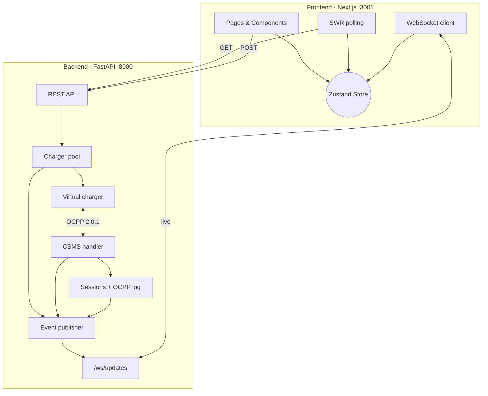
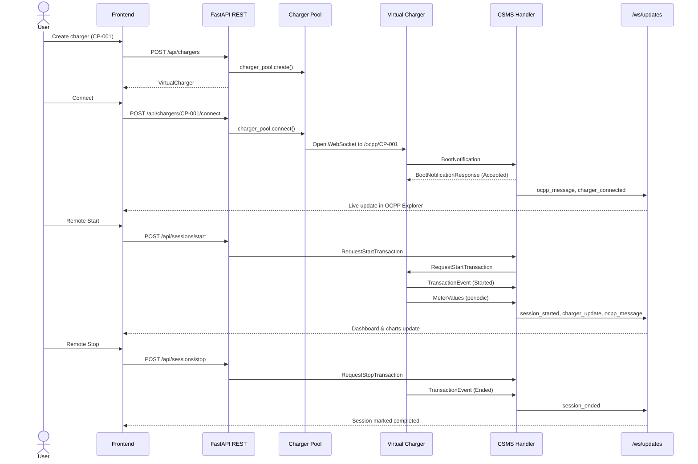

# EV-SIM Frontend

Next.js dashboard for **EV-SIM** — an interactive platform that simulates virtual EV chargers connected to a CitrineOS-inspired CSMS over **OCPP 2.0.1**. The frontend provides live charger monitoring, session tracking, OCPP message inspection, and educational content.

**Backend repo:** [EV-SIM backend](https://github.com/Shriyansh2004/EV-SIM-backend) (or run from `../backend` in the monorepo)

---

## Tech Stack

| Layer | Technology | Version |
|-------|------------|---------|
| Framework | [Next.js](https://nextjs.org/) (App Router) | `14.2.35` |
| Language | TypeScript | `^5` |
| UI | React | `^18.3.1` |
| Styling | Tailwind CSS | `^3.4.1` |
| State | Zustand | `^5.0.3` |
| Data fetching | SWR | `^2.3.0` |
| Charts | Recharts | `^2.15.0` |
| Icons | Lucide React | `^0.469.0` |
| Utilities | clsx | `^2.1.1` |
| Linting | ESLint + eslint-config-next | `^8` / `14.2.35` |

### Backend (paired service)

| Layer | Technology | Version |
|-------|------------|---------|
| Runtime | Python | 3.10+ |
| API | FastAPI | `>=0.115.0` |
| Server | Uvicorn | `>=0.32.0` |
| OCPP | mobilityhouse/ocpp | `>=2.0.0` |
| WebSockets | websockets | `>=13.0` |
| Validation | Pydantic | `>=2.0.0` |

---

## Quick Start

### Prerequisites

- Node.js 18+
- EV-SIM backend running on port **8000**

### Install & run

```bash
npm install
npm run dev
```

Open [http://localhost:3001](http://localhost:3001)

### Scripts

| Command | Description |
|---------|-------------|
| `npm run dev` | Dev server on port 3001 |
| `npm run build` | Production build |
| `npm run start` | Serve production build on port 3001 |
| `npm run lint` | Run ESLint |

### Environment variables

Create `.env.local` (optional — defaults work for local dev):

```env
NEXT_PUBLIC_API_URL=http://localhost:8000
NEXT_PUBLIC_WS_URL=ws://localhost:8000/ws/updates
```

---

## Full-Stack Architecture



### Data flow

1. **Initial load** — `useInitialData` polls REST endpoints every 10–15s and hydrates the Zustand store.
2. **Live updates** — `useOcppWebSocket` connects to `/ws/updates` and applies real-time events (`ocpp_message`, `charger_update`, `session_started`, etc.).
3. **User actions** — Pages call `apiPost` / `apiDelete` to trigger backend commands (create charger, connect, remote start/stop, fault injection).
4. **OCPP layer** — Backend virtual chargers speak OCPP 2.0.1 to the CSMS handler; every message is logged and broadcast to the frontend.

### End-to-end charging workflow



---

## Folder Structure

```
frontend/
├── app/                        # Next.js App Router pages
│   ├── layout.tsx              # Root layout (metadata, global CSS)
│   ├── client-layout.tsx       # Sidebar nav, WebSocket + data hooks
│   ├── globals.css             # Tailwind base styles & theme tokens
│   ├── page.tsx                # Dashboard (/)
│   ├── chargers/
│   │   ├── page.tsx            # Charger list & create form
│   │   └── [id]/page.tsx       # Single charger detail view
│   ├── sessions/page.tsx       # Session history & energy charts
│   ├── ocpp-explorer/page.tsx  # OCPP message log & inspector
│   └── learn/page.tsx          # OCPP education & interactive wizard
│
├── components/
│   ├── chargers/               # Charger-specific UI
│   ├── charts/                 # Recharts visualizations
│   ├── ocpp/                   # OCPP protocol UI
│   ├── sessions/               # Session tables & modals
│   └── ui/                     # Shared primitives (badges, cards)
│
├── hooks/
│   ├── useInitialData.ts       # SWR polling + REST helpers
│   └── useOcppWebSocket.ts     # WebSocket connection & reconnect
│
├── store/
│   └── index.ts                # Zustand global state
│
├── types/
│   └── index.ts                # TypeScript types & API mappers
│
├── next.config.js              # Next.js configuration
├── tailwind.config.ts          # Design tokens & Tailwind theme
├── tsconfig.json               # TypeScript paths (@/* alias)
├── postcss.config.js           # PostCSS (Tailwind + Autoprefixer)
├── package.json
└── .gitignore
```

---

## File Reference

### App (`app/`)

| File | Purpose |
|------|---------|
| `layout.tsx` | Server root layout. Sets page metadata (title, OG tags) and wraps all pages in `ClientLayout`. |
| `client-layout.tsx` | Client shell with sidebar navigation, live WebSocket indicator, and global hooks (`useOcppWebSocket`, `useInitialData`). |
| `globals.css` | Global styles, CSS variables, and Tailwind `@layer` directives for the dark theme. |
| `page.tsx` | **Dashboard** — summary metrics (chargers, sessions, energy), charger grid, recent OCPP log, power chart. |
| `chargers/page.tsx` | **Charger Management** — create/delete chargers, connect/disconnect to CSMS via REST. |
| `chargers/[id]/page.tsx` | **Charger Detail** — live metrics, state machine display, remote controls, SoC gauge, per-charger OCPP log. |
| `sessions/page.tsx` | **Session Monitor** — energy bar chart, sortable session table, detail modal with meter values. |
| `ocpp-explorer/page.tsx` | **OCPP Explorer** — filterable message log, JSON payload inspector, reference sequence diagram. |
| `learn/page.tsx` | **Education** — OCPP concepts, charging sequence diagram, interactive BootNotification wizard. |

### Components (`components/`)

#### Chargers

| File | Purpose |
|------|---------|
| `ChargerCard.tsx` | Compact card showing charger ID, status badge, power, and connection state. |
| `ChargerGrid.tsx` | Responsive grid layout of `ChargerCard` components. |
| `ChargerStateDisplay.tsx` | Visual state machine highlighting the charger's current OCPP status. |
| `ChargerControls.tsx` | Action buttons: Remote Start/Stop, Reset, Set Unavailable, Unlock, Inject Fault. |

#### Charts

| File | Purpose |
|------|---------|
| `PowerChart.tsx` | Live line chart of charging power (kW) across active chargers. |
| `SocGauge.tsx` | Circular gauge for State of Charge percentage. |
| `EnergyBarChart.tsx` | Bar chart comparing energy delivered (kWh) per session. |

#### OCPP

| File | Purpose |
|------|---------|
| `OcppMessageCard.tsx` | Single OCPP message row with direction, action, and timestamp. |
| `OcppMessageLog.tsx` | Scrollable list of OCPP messages, optionally filtered by charger. |
| `OcppMessageInspector.tsx` | Detailed JSON payload viewer with field descriptions from `OCPP_FIELD_DESCRIPTIONS`. |
| `SequenceDiagram.tsx` | Static reference diagram of the OCPP 2.0.1 charging handshake flow. |

#### Sessions

| File | Purpose |
|------|---------|
| `SessionTable.tsx` | Table of all sessions with status, energy, and duration. |
| `SessionDetailModal.tsx` | Modal with full session details and meter value history chart. |
| `MeterValueChart.tsx` | Time-series chart of power/energy/SoC from meter values. |

#### UI

| File | Purpose |
|------|---------|
| `StatusBadge.tsx` | Color-coded badge for OCPP connector statuses (Available, Charging, Faulted, etc.). |
| `MetricCard.tsx` | Dashboard stat card with icon, label, and value. |
| `LiveIndicator.tsx` | Sidebar indicator showing WebSocket connection health. |

### Hooks (`hooks/`)

| File | Purpose |
|------|---------|
| `useInitialData.ts` | Polls `/api/chargers`, `/api/sessions`, and `/api/ocpp/messages` via SWR and syncs into Zustand. Exports `apiPost` and `apiDelete` helpers used by pages. |
| `useOcppWebSocket.ts` | Maintains a persistent WebSocket to `/ws/updates` with auto-reconnect (3s). Dispatches events to `handleWsEvent` in the store. |

### Store (`store/`)

| File | Purpose |
|------|---------|
| `index.ts` | Zustand store holding `chargers`, `sessions`, `ocppMessages`, and `wsConnected`. `handleWsEvent` routes WebSocket event types to the correct state updaters. |

### Types (`types/`)

| File | Purpose |
|------|---------|
| `index.ts` | TypeScript interfaces (`VirtualCharger`, `Session`, `OcppMessage`, `MeterValue`). Snake_case → camelCase mappers for API responses. `API_BASE` and `WS_URL` constants. OCPP action descriptions for the inspector. |

### Config

| File | Purpose |
|------|---------|
| `next.config.js` | Enables React Strict Mode. |
| `tailwind.config.ts` | Dark theme color palette (`background`, `accent`, `charging`, etc.) and font families. |
| `tsconfig.json` | TypeScript config with `@/*` path alias to project root. |
| `postcss.config.js` | PostCSS pipeline for Tailwind and Autoprefixer. |
| `next-env.d.ts` | Auto-generated Next.js type references (do not edit). |

---

## Backend API Integration

The frontend talks to the FastAPI backend on port **8000**.

### REST endpoints used

| Method | Path | Used by | Description |
|--------|------|---------|-------------|
| `GET` | `/api/chargers` | `useInitialData` | List all virtual chargers |
| `POST` | `/api/chargers` | Chargers page, Learn wizard | Create a new charger |
| `DELETE` | `/api/chargers/{id}` | Chargers page | Remove a charger |
| `POST` | `/api/chargers/{id}/connect` | Chargers page, Learn wizard | Connect charger to CSMS (triggers BootNotification) |
| `POST` | `/api/chargers/{id}/disconnect` | Chargers page | Disconnect from CSMS |
| `POST` | `/api/chargers/{id}/fault` | ChargerControls | Inject a simulated fault |
| `GET` | `/api/sessions` | `useInitialData` | List all charging sessions |
| `POST` | `/api/sessions/start` | ChargerControls | Remote start (RequestStartTransaction) |
| `POST` | `/api/sessions/stop` | ChargerControls | Remote stop (RequestStopTransaction) |
| `POST` | `/api/commands/reset` | ChargerControls | Send Reset command |
| `POST` | `/api/commands/availability` | ChargerControls | ChangeAvailability command |
| `POST` | `/api/commands/unlock` | ChargerControls | UnlockConnector command |
| `GET` | `/api/ocpp/messages` | `useInitialData` | Fetch OCPP message history |

### WebSocket events (`/ws/updates`)

| Event type | Payload | Store action |
|------------|---------|--------------|
| `ocpp_message` | Full OCPP log entry | `addOcppMessage` |
| `charger_update` | Status, power, energy, SoC | `upsertCharger` |
| `charger_connected` | `charger_id` | Set `isConnected: true` |
| `charger_disconnected` | `charger_id` | Set `isConnected: false` |
| `session_started` | Session object | `upsertSession` |
| `session_updated` | Session object | `upsertSession` |
| `session_ended` | Session object | `upsertSession` |

---

## Backend Architecture (reference)

For context on what the frontend connects to:

```
backend/
├── app/
│   ├── main.py                 # FastAPI app, CORS, OCPP WebSocket endpoint
│   ├── api/
│   │   ├── chargers.py         # CRUD + connect/disconnect/fault
│   │   ├── sessions.py         # List sessions, remote start/stop
│   │   ├── commands.py         # Reset, availability, unlock
│   │   └── ws.py               # Frontend broadcast WebSocket
│   ├── csms/
│   │   ├── csms_handler.py     # OCPP 2.0.1 CSMS (BootNotification, TransactionEvent, etc.)
│   │   ├── command_service.py  # Outbound CSMS → CP commands
│   │   ├── session_manager.py  # Session lifecycle tracking
│   │   └── ws_adapter.py       # FastAPI ↔ ocpp library WebSocket bridge
│   ├── virtual_charger/
│   │   ├── charger.py          # Virtual charger OCPP client (CP side)
│   │   ├── charger_pool.py     # Manages multiple virtual chargers
│   │   └── simulator.py        # Background simulation loop
│   ├── ocpp_log/
│   │   └── logger.py           # In-memory OCPP message store
│   └── models/
│       └── schemas.py          # Pydantic models (shared API contract)
```

### Start the backend

```bash
cd ../backend
python3 -m venv venv
source venv/bin/activate
pip install -r requirements.txt
uvicorn app.main:app --reload --host 0.0.0.0 --port 8000
```

---

## Usage Flow

1. **Start backend** on port 8000, then **start frontend** on port 3001.
2. **Create a charger** — Chargers page → enter ID (e.g. `CP-001`), power, connectors.
3. **Connect to CSMS** — Click Connect → virtual charger opens OCPP WebSocket and sends `BootNotification`.
4. **Remote Start** — Charger detail page → Remote Start → `RequestStartTransaction` → `TransactionEvent (Started)`.
5. **Watch live data** — Dashboard and OCPP Explorer update via WebSocket as `MeterValues` and `TransactionEvent` messages flow.
6. **Remote Stop** — Ends the session with `TransactionEvent (Ended)`.
7. **Fault Injection** — Simulate connector errors from the charger detail controls.

---

## Design System

The UI uses a dark GitHub-inspired palette defined in `tailwind.config.ts`:

| Token | Color | Usage |
|-------|-------|-------|
| `background` | `#0D1117` | Page background |
| `surface` | `#161B22` | Cards, sidebar |
| `accent` | `#00D4AA` | Primary actions, connected state |
| `charging` | `#3B82F6` | Active charging metrics |
| `warning` | `#F59E0B` | Fault injection, alerts |
| `error` | `#EF4444` | Stop actions, errors |
| `muted` | `#8B949E` | Secondary text |

Fonts: **Inter** (sans-serif) for UI, **JetBrains Mono** for charger IDs and OCPP payloads.

---

## Related Projects

- [EV-SIM](https://github.com/Shriyansh2004/EV-SIM) — Full monorepo (backend + frontend)
- [ocpp-virtual-charge-point](https://github.com/mobilityhouse/ocpp) — OCPP virtual charger patterns
- [CitrineOS](https://github.com/citrineos/citrineos-core) — CSMS handler reference
