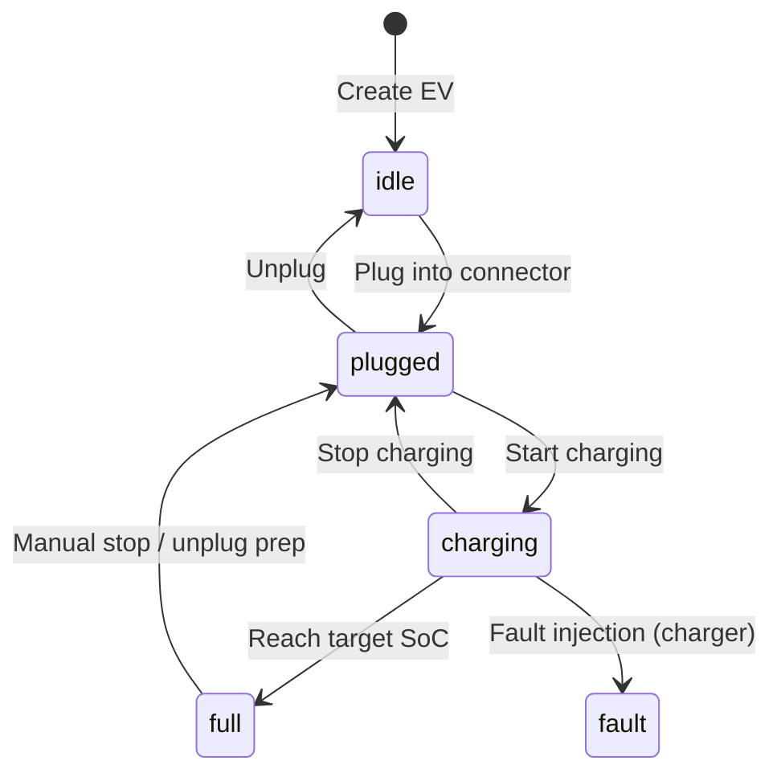
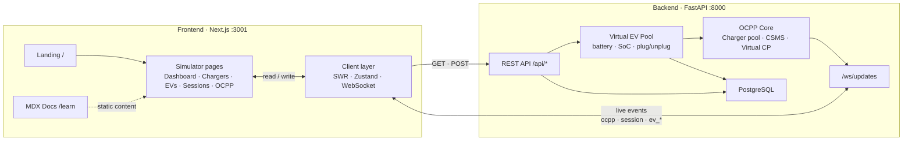
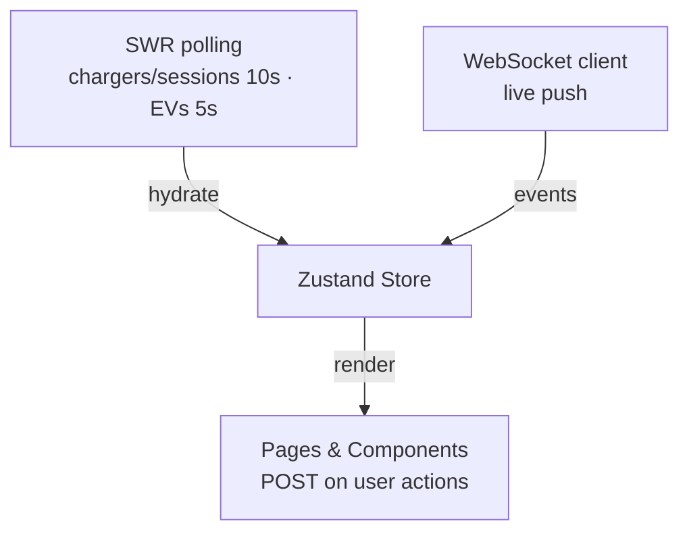
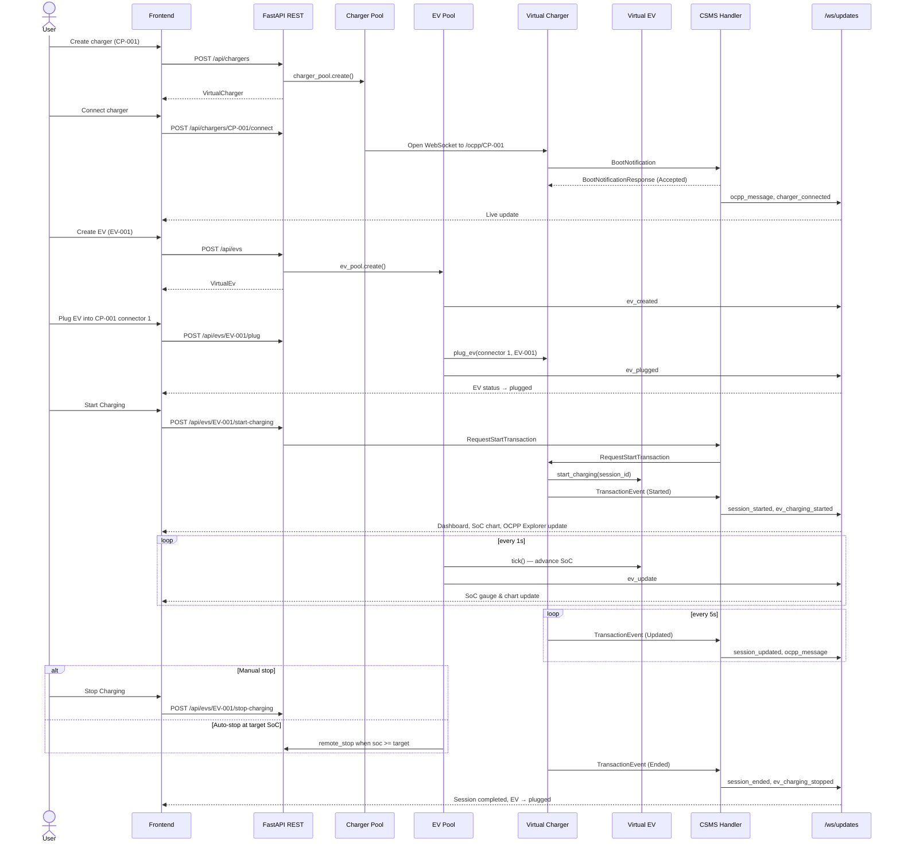

# EV-SIM Frontend

Next.js dashboard for **EV-SIM** — a full-stack platform that simulates **virtual electric vehicles (EVs)** and **virtual chargers** connected to a CitrineOS-inspired CSMS over **OCPP 2.0.1**. The frontend includes a marketing landing page, a live simulator dashboard, EV fleet management (create, plug, charge, monitor SoC), charger monitoring, session tracking, OCPP message inspection, and an MDX-powered documentation hub.

**Backend repo:** [EV-SIM backend](https://github.com/Shriyansh2004/EV-SIM-backend) (or run from `../backend` in a local checkout)

---

## Tech Stack

| Layer | Technology | Version |
|-------|------------|---------|
| Framework | [Next.js](https://nextjs.org/) (App Router) | `14.2.35` |
| Language | TypeScript | `^5` |
| UI | React | `^18.3.1` |
| Styling | Tailwind CSS | `^3.4.1` |
| State | Zustand | `^5.0.3` |
| Data fetching | SWR | `^2.3.0` |
| Charts | Recharts | `^2.15.0` |
| 3D (landing hero) | Three.js + React Three Fiber | `^0.169.0` / `^8.18.0` |
| Documentation | next-mdx-remote + gray-matter | `^6.0.0` |
| Search (docs) | Fuse.js + cmdk | `^7.4.2` / `^1.1.1` |
| Animation | GSAP | `^3.15.0` |
| Icons | Lucide React | `^0.469.0` |
| Utilities | clsx | `^2.1.1` |
| Linting | ESLint + eslint-config-next | `^8` / `14.2.35` |

### Backend (paired service)

| Layer | Technology | Version |
|-------|------------|---------|
| Runtime | Python | 3.10+ |
| API | FastAPI | `>=0.115.0` |
| Server | Uvicorn | `>=0.32.0` |
| OCPP | mobilityhouse/ocpp | `>=2.0.0` |
| WebSockets | websockets | `>=13.0` |
| Validation | Pydantic | `>=2.0.0` |
| Database | PostgreSQL + SQLAlchemy | 16 / `>=2.0.0` |

---

## Quick Start

### Prerequisites

- Node.js 18+
- EV-SIM backend running on port **8000**
- PostgreSQL running (via `docker compose up -d` in `../backend`)

### Install & run

```bash
npm install
cp .env.local.example .env.local   # if present; otherwise create from template below
npm run dev
```

| URL | Page |
|-----|------|
| [http://localhost:3001](http://localhost:3001) | Landing page (3D hero, product overview) |
| [http://localhost:3001/dashboard](http://localhost:3001/dashboard) | Simulator dashboard |
| [http://localhost:3001/evs](http://localhost:3001/evs) | Electric Vehicles (EV simulator) |
| [http://localhost:3001/learn](http://localhost:3001/learn) | Documentation hub |

### Scripts

| Command | Description |
|---------|-------------|
| `npm run dev` | Dev server on port 3001 |
| `npm run build` | Production build |
| `npm run start` | Serve production build on port 3001 |
| `npm run lint` | Run ESLint |
| `npm run typecheck` | TypeScript check without emit |

### Environment variables

Create `.env.local` (required — the app reads config from `lib/env.ts`):

```env
NEXT_PUBLIC_API_URL=http://localhost:8000
NEXT_PUBLIC_WS_URL=ws://localhost:8000/ws/updates

# GitHub links (landing footer, docs)
NEXT_PUBLIC_GITHUB_FRONTEND_URL=https://github.com/Shriyansh2004/EV-SIM-frontend
NEXT_PUBLIC_GITHUB_BACKEND_URL=https://github.com/Shriyansh2004/EV-SIM-backend

# Demo / reference links
NEXT_PUBLIC_DEMO_ID_TOKEN=demo-token
NEXT_PUBLIC_REF_CITRINEOS_URL=https://github.com/citrineos/citrineos-core
NEXT_PUBLIC_REF_VCP_URL=https://github.com/mobilityhouse/ocpp
NEXT_PUBLIC_REF_EVEREST_URL=https://github.com/EVerest/everest

# Optional
NEXT_PUBLIC_ASSET_BASE_URL=
NEXT_PUBLIC_GITHUB_FRONTEND_LABEL=
```

Site copy, navigation labels, EV presets, and page text are driven by `content/site-content.json` (not env vars).

---

## Platform Overview

### Routes

| Route | Description |
|-------|-------------|
| `/` | Public landing page with interactive 3D EV + charger scene |
| `/dashboard` | Live simulator overview — chargers, EVs, sessions, OCPP, power chart |
| `/chargers` | Create, connect, and manage virtual charge points |
| `/chargers/[id]` | Charger detail — connectors, state machine, remote controls, OCPP log |
| `/evs` | **EV simulator** — fleet list, create EV, fleet stats |
| `/evs/[id]` | **EV detail** — SoC chart, battery panel, plug/unplug, charge controls |
| `/sessions` | Session history, energy charts, meter value detail |
| `/ocpp-explorer` | Filterable OCPP 2.0.1 message log and JSON inspector |
| `/learn/[[...slug]]` | MDX documentation (getting started, OCPP, CSMS, using EV-SIM, reference) |

### Navigation

The app shell sidebar (Dashboard → Chargers → Electric Vehicles → Sessions → OCPP Explorer → Learn) is defined in `content/site-content.json` under `navigation.app`. The landing page at `/` renders without the sidebar; all simulator routes use `components/layout/ClientLayout.tsx`.

---

## Virtual EV Simulator

EV-SIM models **software-defined electric vehicles** with realistic battery behaviour. Virtual EVs are first-class entities — not just passive session metadata. You create them, plug them into charger connectors, start OCPP charging sessions, and watch live SoC, power, voltage, and current update in real time.

### What the simulator does

| Capability | Description |
|------------|-------------|
| **Fleet management** | Create multiple virtual EVs, each with its own battery profile and state |
| **Vehicle presets** | Built-in profiles (Tesla Model 3, BMW i4, Nissan Leaf, etc.) or fully custom parameters |
| **Plug / unplug** | Attach an EV to a specific charger connector; one EV per connector |
| **Charging sessions** | EV-centric start/stop triggers real OCPP `RequestStartTransaction` / `RequestStopTransaction` |
| **Live telemetry** | SoC, power (kW), voltage (V), current (A), and energy delivered update every second |
| **Realistic taper** | Charge power reduces above 70% SoC to mimic real battery behaviour |
| **Auto-stop** | Charging stops automatically when `targetSocPercent` is reached |
| **OCPP integration** | EV telemetry flows into charger meter values and `TransactionEvent` payloads |

### EV lifecycle states



| Status | Meaning | UI badge |
|--------|---------|----------|
| `idle` | Created, not connected to any charger | Idle |
| `plugged` | Connected to a charger connector, not charging | Plugged |
| `charging` | Active OCPP session, battery SoC increasing | Charging |
| `full` | Target SoC reached, session complete | Full |
| `fault` | Charger/connector fault while plugged | Fault |

### Battery model (backend)

The backend `VirtualEvClient` (`backend/app/virtual_ev/ev.py`) advances each charging EV every **1 second**:

1. **Power calculation** — `min(ev_max_kw, charger_max_kw)` with a taper curve:
   - 100% power below 70% SoC
   - 80% at 70–79%, 55% at 80–89%, 30% at 90–94%, 15% at 95%+
   - 0 kW at or above `target_soc_percent`
2. **SoC update** — `soc_delta = (energy_kwh / battery_capacity_kwh) × 100`
3. **Electrical telemetry** — 400 V bus; `current_a = (power_kw × 1000) / 400`
4. **Broadcast** — `ev_update` WebSocket event pushed to the frontend each tick

### Vehicle presets

Presets are served by `GET /api/evs/presets` with a client-side fallback from `content/site-content.json` (`evPresets` array) and `lib/content.ts`.

| Preset | Type | Battery | AC max | DC max |
|--------|------|---------|--------|--------|
| Tesla Model 3 Long Range | BEV | 82 kWh | 11.5 kW | 250 kW |
| Nissan Leaf e+ | BEV | 62 kWh | 6.6 kW | 100 kW |
| BMW i4 eDrive40 | BEV | 83.9 kWh | 11 kW | 205 kW |
| Hyundai IONIQ 5 | BEV | 77.4 kWh | 11 kW | 233 kW |
| Chevrolet Bolt EV | BEV | 65 kWh | 7.7 kW | 55 kW |
| Volkswagen ID.4 Pro | BEV | 82 kWh | 11 kW | 135 kW |
| Toyota Prius Prime | PHEV | 13.6 kWh | 3.3 kW | — |
| Generic BEV | BEV | 75 kWh | 11 kW | 150 kW |

Custom EVs accept: ID, vendor, model, `ev_type` (BEV/PHEV/HEV), battery capacity, AC/DC charge limits, initial SoC, and target SoC.

### Frontend EV UI

| Page / component | Role |
|------------------|------|
| `app/evs/page.tsx` | Fleet summary (total / plugged / charging), `EvCreateForm`, `EvCard` grid |
| `app/evs/[id]/page.tsx` | EV detail — SoC chart, charge controls, plug panel, battery panel |
| `EvCreateForm.tsx` | Preset picker or custom battery fields → `POST /api/evs` |
| `EvPlugPanel.tsx` | Select charger + connector → `POST /api/evs/{id}/plug` or `/unplug` |
| `EvChargeControls.tsx` | Start/stop charging → `POST /api/evs/{id}/start-charging` or `/stop-charging` |
| `EvSocChart.tsx` | Live Recharts line chart driven by `ev_update` WebSocket events |
| `EvBatteryPanel.tsx` | Capacity, target SoC, power, voltage, current, energy delivered |
| `EvBatteryMonitor.tsx` | Compact battery widget (usable on dashboard) |
| `EvStatusBadge.tsx` | Color-coded status badge |
| `ConnectorPanel.tsx` / `ConnectorDetail.tsx` | Charger-side view of which EV is on each connector |

### EV REST API

| Method | Path | Used by | Description |
|--------|------|---------|-------------|
| `GET` | `/api/evs` | `useInitialData` (5s poll) | List all virtual EVs |
| `GET` | `/api/evs/presets` | `useEvPresets`, `EvCreateForm` | Built-in vehicle presets |
| `POST` | `/api/evs` | `EvCreateForm` | Create a new EV |
| `DELETE` | `/api/evs/{id}` | EVs page | Remove an idle/plugged EV |
| `POST` | `/api/evs/{id}/plug` | `EvPlugPanel` | Plug EV into charger connector |
| `POST` | `/api/evs/{id}/unplug` | `EvPlugPanel` | Unplug EV from charger |
| `POST` | `/api/evs/{id}/start-charging` | `EvChargeControls` | Start OCPP session (must be plugged) |
| `POST` | `/api/evs/{id}/stop-charging` | `EvChargeControls` | Stop active charging session |

### EV WebSocket events

| Event type | When fired | Store action |
|------------|------------|--------------|
| `ev_created` | New EV registered | `upsertEv` |
| `ev_plugged` | EV attached to connector | `upsertEv` |
| `ev_unplugged` | EV detached from connector | `upsertEv` |
| `ev_charging_started` | OCPP session started | `upsertEv` |
| `ev_charging_stopped` | Session ended (manual or auto-stop) | `upsertEv` |
| `ev_update` | 1s telemetry tick during charging | `upsertEv` |
| `ev_deleted` | EV removed | `removeEv` |

---

## Full-Stack Architecture

### System overview



| Arrow | From | To | What flows |
|-------|------|----|------------|
| → | Simulator pages | Client layer | User actions, rendered state |
| → | Client layer | REST API | `GET` polls + `POST` commands |
| ↔ | Client layer | `/ws/updates` | Real-time OCPP, charger, session, and EV events |
| → | REST API | OCPP Core + EV Pool | Create/connect/control chargers and EVs |
| → | EV Pool | OCPP Core | Plugged EV drives charge power and meter values |
| → | OCPP Core | `/ws/updates` | Broadcast session, charger, and message updates |

### Frontend client layer



### Data flow

1. **Initial load** — `useInitialData` polls REST endpoints (EVs every 5s, chargers/sessions every 10s, OCPP messages every 15s) and hydrates the Zustand store.
2. **Live updates** — `useOcppWebSocket` connects to `/ws/updates` and applies real-time events (`ocpp_message`, `charger_update`, `session_started`, `ev_update`, etc.).
3. **User actions** — Pages call `apiPost` / `apiDelete` from `lib/api.ts` to trigger backend commands.
4. **EV simulation** — Backend simulator ticks EV batteries every 1s; charge power follows a realistic taper curve; OCPP meter values reflect EV telemetry.
5. **OCPP layer** — Virtual chargers speak OCPP 2.0.1 to the CSMS handler; every message is logged and broadcast to the frontend.

### End-to-end charging workflow

The recommended flow is **EV-centric**: create a charger, connect it, create an EV, plug the EV, then start charging.



---

## Folder Structure

```
frontend/
├── app/                              # Next.js App Router
│   ├── layout.tsx                    # Root layout (fonts, metadata, ClientLayout)
│   ├── page.tsx                      # Landing page (/)
│   ├── globals.css                   # Tailwind layers & theme CSS variables
│   ├── dashboard/page.tsx            # Simulator dashboard
│   ├── chargers/
│   │   ├── page.tsx                  # Charger list & create form
│   │   └── [id]/page.tsx             # Charger detail
│   ├── evs/
│   │   ├── page.tsx                  # EV fleet & create form
│   │   └── [id]/page.tsx             # EV detail (SoC, plug, charge)
│   ├── sessions/page.tsx             # Session history & charts
│   ├── ocpp-explorer/page.tsx        # OCPP message log & inspector
│   └── learn/
│       ├── layout.tsx                # Docs shell wrapper
│       └── [[...slug]]/page.tsx      # MDX documentation pages
│
├── components/
│   ├── layout/ClientLayout.tsx       # App shell: sidebar, WebSocket, data hooks
│   ├── landing/                      # Landing page (3D hero, navbar, footer)
│   ├── evs/                          # EV simulator UI
│   ├── chargers/                     # Charger UI
│   ├── charts/                       # Recharts visualizations
│   ├── ocpp/                         # OCPP protocol UI
│   ├── sessions/                     # Session tables & modals
│   ├── docs/                         # MDX docs shell (sidebar, search, TOC)
│   ├── learn/                        # Embedded diagrams for docs
│   └── ui/                           # Shared primitives
│
├── content/
│   ├── site-content.json             # Site copy, nav, presets, page labels
│   └── learn/                        # MDX documentation articles
│       ├── getting-started/
│       ├── ev-charging-fundamentals/
│       ├── the-ocpp-protocol/
│       ├── csms-system-architecture/
│       ├── using-ev-sim/
│       └── reference/
│
├── lib/
│   ├── api.ts                        # fetcher, apiPost, apiDelete
│   ├── env.ts                        # Environment variable accessors
│   ├── content.ts                    # site-content.json loader & asset URLs
│   ├── docs/                         # MDX slug resolution, categories
│   ├── chartTheme.ts                 # Recharts theme tokens
│   └── ocppFilters.ts                # OCPP Explorer filter helpers
│
├── hooks/
│   ├── useInitialData.ts             # SWR polling + useEvPresets
│   └── useOcppWebSocket.ts           # WebSocket connection & reconnect
│
├── store/
│   └── index.ts                      # Zustand global state + handleWsEvent
│
├── types/
│   └── index.ts                      # TypeScript types & API mappers
│
├── public/
│   ├── logo.png
│   └── models/                       # GLB assets for landing 3D scene
│
├── next.config.js
├── tailwind.config.ts
├── tsconfig.json
├── postcss.config.js
└── package.json
```

---

## File Reference

### App (`app/`)

| File | Purpose |
|------|---------|
| `layout.tsx` | Server root layout. Loads Inter / JetBrains Mono fonts, metadata from `content/site-content.json`, wraps pages in `ClientLayout`. |
| `page.tsx` | **Landing page** — 3D hero scene, product copy, CTA to `/dashboard`. |
| `dashboard/page.tsx` | **Dashboard** — fleet metrics (chargers, EVs, sessions, energy), charger grid, recent OCPP log, power chart, charging EV alert. |
| `chargers/page.tsx` | **Charger Management** — create/delete chargers, connect/disconnect to CSMS. |
| `chargers/[id]/page.tsx` | **Charger Detail** — connectors (with plugged EVs), state machine, remote controls, OCPP log. |
| `evs/page.tsx` | **EV Fleet** — fleet summary, `EvCreateForm`, delete idle EVs. |
| `evs/[id]/page.tsx` | **EV Detail** — live SoC chart, battery panel, plug/unplug, start/stop charging. |
| `sessions/page.tsx` | **Session Monitor** — energy bar chart, sortable session table (with linked EV), detail modal. |
| `ocpp-explorer/page.tsx` | **OCPP Explorer** — direction tabs, filterable message log, JSON inspector, traffic timeline. |
| `learn/[[...slug]]/page.tsx` | **Documentation** — renders MDX from `content/learn/` with search, TOC, prev/next. |

### Key components

| Area | Files | Purpose |
|------|-------|---------|
| Layout | `ClientLayout.tsx`, `LiveIndicator.tsx` | Collapsible sidebar nav, WebSocket + SWR hooks, sim running indicator |
| Landing | `LandingPage.tsx`, `Hero3DVisual.tsx`, `HeroSection.tsx` | Marketing page with Three.js EV/charger/CSMS scene |
| EVs | `EvCreateForm`, `EvCard`, `EvSocChart`, `EvPlugPanel`, `EvChargeControls`, `EvBatteryPanel` | Full EV simulator UI |
| Docs | `DocsShell`, `DocsSidebar`, `DocsSearch`, `mdx-components` | Searchable MDX documentation hub |
| OCPP | `OcppMessageLog`, `OcppMessageInspector`, `OcppTrafficTimeline`, `SequenceDiagram` | Protocol inspection tools |

### Lib & hooks

| File | Purpose |
|------|---------|
| `lib/api.ts` | `fetcher`, `apiPost`, `apiDelete` — all REST calls go through here |
| `lib/env.ts` | Required `NEXT_PUBLIC_*` environment variables |
| `lib/content.ts` | Loads `site-content.json`; resolves asset URLs and GitHub links |
| `hooks/useInitialData.ts` | SWR polling for chargers, EVs (5s), sessions, OCPP messages |
| `hooks/useOcppWebSocket.ts` | Persistent WebSocket with 3s auto-reconnect |
| `store/index.ts` | Zustand store; `handleWsEvent` routes all `ev_*` and OCPP events |

---

## Backend API Integration

The frontend talks to the FastAPI backend on port **8000**. See [Virtual EV Simulator](#virtual-ev-simulator) above for EV-specific endpoints and WebSocket events.

### Charger & session REST endpoints

| Method | Path | Used by | Description |
|--------|------|---------|-------------|
| `GET` | `/api/chargers` | `useInitialData` | List all virtual chargers |
| `POST` | `/api/chargers` | Chargers page | Create a new charger |
| `DELETE` | `/api/chargers/{id}` | Chargers page | Remove a charger |
| `POST` | `/api/chargers/{id}/connect` | Chargers page | Connect charger to CSMS |
| `POST` | `/api/chargers/{id}/disconnect` | Chargers page | Disconnect from CSMS |
| `POST` | `/api/chargers/{id}/fault` | ChargerControls | Inject a simulated fault |
| `GET` | `/api/sessions` | `useInitialData` | List all charging sessions |
| `POST` | `/api/sessions/start` | ChargerControls | Remote start (RequestStartTransaction) |
| `POST` | `/api/sessions/stop` | ChargerControls | Remote stop (RequestStopTransaction) |
| `POST` | `/api/commands/reset` | ChargerControls | Send Reset command |
| `POST` | `/api/commands/availability` | ChargerControls | ChangeAvailability command |
| `POST` | `/api/commands/unlock` | ChargerControls | UnlockConnector command |
| `GET` | `/api/ocpp/messages` | `useInitialData` | Fetch OCPP message history |

### WebSocket events (`/ws/updates`)

| Event type | Payload | Store action |
|------------|---------|--------------|
| `ocpp_message` | Full OCPP log entry | `addOcppMessage` |
| `charger_update` | Status, power, energy, SoC | `upsertCharger` |
| `charger_connected` | `charger_id` | Set `isConnected: true` |
| `charger_disconnected` | `charger_id` | Set `isConnected: false` |
| `session_started` | Session object | `upsertSession` |
| `session_updated` | Session object | `upsertSession` |
| `session_ended` | Session object | `upsertSession` |
| `ev_created` | VirtualEv object | `upsertEv` |
| `ev_plugged` | VirtualEv object | `upsertEv` |
| `ev_unplugged` | VirtualEv object | `upsertEv` |
| `ev_charging_started` | VirtualEv object | `upsertEv` |
| `ev_charging_stopped` | VirtualEv object | `upsertEv` |
| `ev_update` | VirtualEv telemetry (SoC, power, etc.) | `upsertEv` |
| `ev_deleted` | `{ ev_id }` | `removeEv` |

---

## Backend Architecture (reference)

```
backend/
├── app/
│   ├── main.py                 # FastAPI app, CORS, OCPP WebSocket, DB init on startup
│   ├── api/
│   │   ├── chargers.py         # CRUD + connect/disconnect/fault
│   │   ├── evs.py              # EV CRUD + plug/unplug/start/stop charging
│   │   ├── sessions.py         # List sessions, remote start/stop
│   │   ├── commands.py         # Reset, availability, unlock
│   │   └── ws.py               # Frontend broadcast WebSocket
│   ├── csms/
│   │   ├── csms_handler.py     # OCPP 2.0.1 CSMS (BootNotification, TransactionEvent, etc.)
│   │   ├── command_service.py  # Outbound CSMS → CP commands
│   │   ├── session_manager.py  # Session lifecycle tracking (PostgreSQL-backed)
│   │   └── ws_adapter.py       # FastAPI ↔ ocpp library WebSocket bridge
│   ├── virtual_charger/
│   │   ├── charger.py          # Virtual charger OCPP client (CP side)
│   │   ├── charger_pool.py     # Manages multiple virtual chargers
│   │   └── simulator.py        # 1s EV battery tick loop
│   ├── virtual_ev/
│   │   ├── ev.py               # EV battery model, SoC curve, telemetry
│   │   ├── ev_pool.py          # EV lifecycle + PostgreSQL persistence
│   │   └── presets.py          # Built-in vehicle presets
│   ├── db/
│   │   ├── database.py         # Async SQLAlchemy + PostgreSQL
│   │   ├── models.py           # ORM models
│   │   └── repository.py       # CRUD repositories
│   ├── ocpp_log/
│   │   └── logger.py           # In-memory OCPP message store
│   └── models/
│       └── schemas.py          # Pydantic models (shared API contract)
├── docker-compose.yml          # PostgreSQL 16
└── .env.example                # DATABASE_URL
```

### Start the backend

```bash
cd ../backend
docker compose up -d            # PostgreSQL
cp .env.example .env            # optional
python3 -m venv venv
source venv/bin/activate
pip install -r requirements.txt
uvicorn app.main:app --reload --host 0.0.0.0 --port 8000
```

---

## Usage Flow

The complete EV-SIM demo follows nine steps. Open the landing page, click **Launch Simulator**, then use the sidebar.

### 1. Start infrastructure

Start PostgreSQL (`docker compose up -d` in `backend/`), then the backend on port 8000, then the frontend on port 3001.

### 2. Create a charger

**Chargers** → enter ID (e.g. `CP-001`), max power (kW), connector count → **Add Charger**.

The charger is saved to PostgreSQL immediately.

### 3. Connect charger to CSMS

Click **Connect** on the charger card → virtual charger opens an OCPP WebSocket and sends `BootNotification`.

Watch the OCPP Explorer for live messages. The charger status becomes connected.

### 4. Create an electric vehicle

**Electric Vehicles** → pick a preset (Tesla Model 3, BMW i4, etc.) or enter custom battery parameters → set initial SoC and target SoC → **Create**.

The EV starts in `idle` state.

### 5. Plug EV into charger

Open the **EV detail page** → **Plug into Charger** panel → select charger and connector → **Plug In**.

The EV status becomes `plugged`. The charger connector shows the linked EV. Only one EV per connector.

### 6. Start charging

On the EV detail page → **Start Charging** (or use Remote Start on the charger detail page).

This sends `RequestStartTransaction` over OCPP. A session is created with the EV linked. The SoC chart and battery panel update every second via `ev_update` WebSocket events.

### 7. Monitor live data

While charging, watch:

- **EV detail** — SoC chart, power, voltage, current
- **Dashboard** — fleet summary (including EV count), power chart, charging EV alert
- **Sessions** — active session with energy and SoC
- **OCPP Explorer** — `TransactionEvent` Started/Updated/Ended messages

Charging power tapers above 70% SoC. When target SoC is reached, charging stops automatically.

### 8. Stop charging

Click **Stop Charging** on the EV detail page, or wait for auto-stop at target SoC.

The session ends with `TransactionEvent (Ended)`. The EV returns to `plugged` status.

### 9. Unplug and cleanup (optional)

**Unplug** the EV from the charger connector. Delete idle EVs or chargers from their list pages.

### Fault injection (optional)

From the **charger detail page**, inject `connector_error`, `network_drop`, or `power_loss` to simulate failures.

---

## Documentation (`/learn`)

The Learn section is a full MDX documentation site with six categories:

| Category | Topics |
|----------|--------|
| Getting Started | What is EV-SIM, quick start, core concepts |
| EV Charging Fundamentals | How charging works, SoC, connector levels |
| The OCPP Protocol | Message types, transaction lifecycle, Boot/Heartbeat |
| CSMS & System Architecture | CSMS role, WebSocket lifecycle, CP vs central system |
| Using EV-SIM | Creating chargers, controlling sessions, reading OCPP logs, live charts |
| Reference | FAQ, OCPP glossary, status codes |

Articles live in `content/learn/`. Navigation order and labels are configured in `content/site-content.json` under `learn.categories`. Docs support search (`⌘K`), table of contents, and prev/next navigation.

---

## Design System

The UI uses a MATLAB-inspired light theme with an orange sidebar, defined in `tailwind.config.ts` and `globals.css`:

| Token | Color | Usage |
|-------|-------|-------|
| `background` | `#f0f0f0` | Page background |
| `surface` | `#ffffff` | Cards, panels |
| `matlab-blue` | `#0072bd` | Primary actions, charging metrics |
| `matlab-orange` | `#d95319` | Sidebar, accent controls |
| `matlab-yellow` | `#edb120` | Warnings, plugged-in stats |
| `matlab-purple` | `#7e2f8e` | EV fleet metrics |
| `matlab-green` | `#77ac30` | Connected / success states |
| `matlab-red` | `#a2142f` | Stop actions, errors |
| `muted` | `#616161` | Secondary text |
| `sidebar` | `#ea580c` | App sidebar background |

Fonts: **Helvetica Neue / Inter** for UI, **Consolas / JetBrains Mono** for IDs and OCPP payloads.

---

## Related Projects

- [EV-SIM Frontend](https://github.com/Shriyansh2004/EV-SIM-frontend) — Next.js dashboard
- [EV-SIM Backend](https://github.com/Shriyansh2004/EV-SIM-backend) — FastAPI + OCPP CSMS
- [ocpp-virtual-charge-point](https://github.com/mobilityhouse/ocpp) — OCPP virtual charger patterns
- [CitrineOS](https://github.com/citrineos/citrineos-core) — CSMS handler reference
